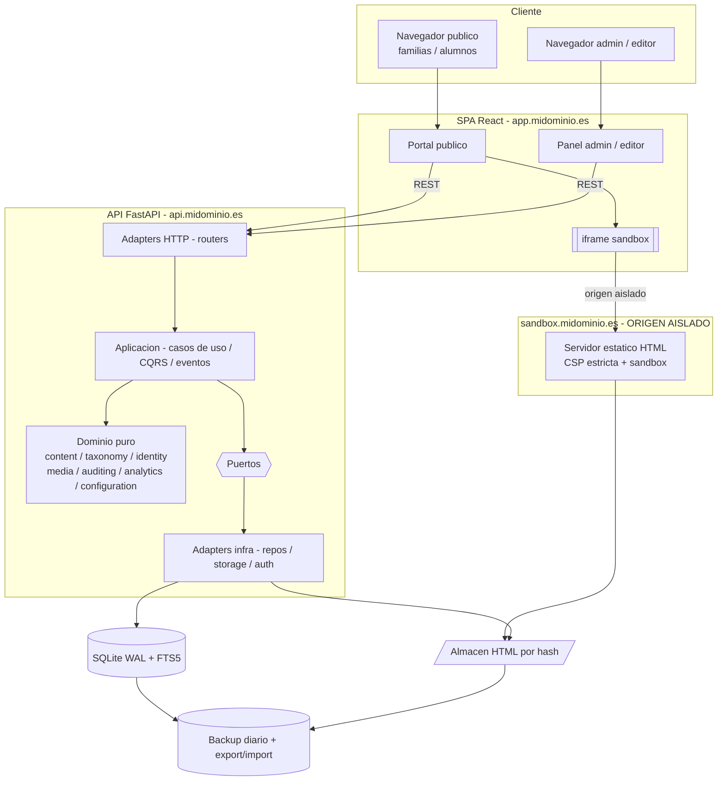

# Arquitectura del Proyecto — Plataforma Educativa (CMS de ejercicios infantil/primaria)

> Documentación como código. Este archivo describe la arquitectura de referencia.
> Toda decisión de diseño debe ser coherente con este documento o actualizarlo mediante PR.

## 1. Visión general

Aplicación web (escritorio y móvil) para alojar y ejecutar **ejercicios educativos interactivos**
(infantil y primaria) y **artículos de texto**, gestionados mediante un CMS con dos roles
privilegiados (`admin`, `editor`). Acceso público sin cuentas de alumno.

- **Backend:** FastAPI (Python), SQLite (modo WAL) + FTS5, migraciones con Alembic.
- **Frontend:** React (SPA, Vite).
- **Despliegue:** Docker sobre VPS único.
- **Estilo arquitectónico:** Monolito modular + Arquitectura Hexagonal (Ports & Adapters)
  + Clean Architecture + DDD táctico ligero.
- **Patrones selectivos:** CQRS lógico (separación lectura/escritura, sin segunda BD),
  eventos de dominio **en proceso** (auditoría y conteo de visitas). Sin broker, sin
  microservicios, sin event sourcing.

## 2. Decisiones arquitectónicas y su justificación

| # | Decisión | Justificación |
|---|----------|---------------|
| AD-1 | Monolito modular hexagonal | Escala de cientos de usuarios, un mantenedor. Microservicios/broker serían sobre-ingeniería. |
| AD-2 | SQLite (WAL) + FTS5 | Patrón mayoritariamente de lectura, pocos escritores. WAL permite lecturas concurrentes; FTS5 da buscador full-text nativo. |
| AD-3 | Ejercicios en iframe con **origen aislado** (`sandbox.dominio`) | Aísla por diseño el JS arbitrario del ejercicio del origen del CMS. No negociable. |
| AD-4 | HTML direccionado por hash (content-addressed, inmutable) | Habilita versionado, restauración, papelera y export/import coherentes. |
| AD-5 | Contador de visitas agregado en memoria + volcado por lotes | Evita amplificación de escritura sobre el único escritor de SQLite. |
| AD-6 | CQRS solo lógico; eventos solo en proceso | "CQRS/EDA cuando aporte valor". Aquí aportan en lectura/escritura y auditoría, no más. |
| AD-7 | Auth local (Argon2/bcrypt), sin OAuth | 1–3 usuarios de confianza. Menos dependencias, más simple. |
| AD-8 | Monetización solo en zonas de adultos + donaciones | Cumplimiento DSA art. 28 (prohibición de publicidad perfilada a menores) y Privacy by Design. |
| AD-9 | Export/import de SQLite + HTMLs como capacidad de primera clase | Respaldo, portabilidad y ruta de migración. |

## 3. Diagrama lógico



## 4. Contextos acotados (Bounded Contexts)

| Contexto | Responsabilidad | Agregado raíz |
|----------|-----------------|---------------|
| `content` | Ejercicios y artículos, tipos, versionado, papelera | `Contenido` |
| `taxonomy` | Ciclos, cursos, asignaturas, etiquetas (configurables) | `Catalogo` |
| `identity` | Usuarios admin/editor, roles, autenticación | `Usuario` |
| `media` | Almacenamiento y serving sandboxed de HTML | `FicheroHtml` |
| `auditing` | Registro de auditoría + lineage de versiones | `EntradaAuditoria` |
| `analytics` | Contador de visitas agregado | `ContadorVisitas` |
| `configuration` | Nombre, logo, slots publicitarios, ajustes | `ConfiguracionSitio` |

Los contextos se comunican entre sí **solo** mediante casos de uso de la capa de aplicación o
eventos de dominio en proceso. No se importan modelos de un contexto en otro.

## 5. Capas y regla de dependencia

```
infrastructure  ->  application  ->  domain
        (las dependencias apuntan SIEMPRE hacia el dominio)
```

- **domain/**: entidades, agregados, value objects, eventos de dominio, errores y **puertos**
  (interfaces de repositorio/servicios). Cero dependencias de framework.
- **application/**: casos de uso, comandos y consultas (CQRS), orquestación, unit of work.
- **infrastructure/**: adapters concretos (repos SQLAlchemy, storage de ficheros, hashing de
  contraseñas, routers FastAPI). Implementa los puertos del dominio.

## 6. Estructura de carpetas

### Backend
```
backend/
  app/
    main.py
    config.py
    bootstrap.py
    shared/
      domain/         # base entity, value objects, domain events, errors
      application/    # command/query buses, unit of work, base use case
      infrastructure/ # db engine, structured logging
    contexts/
      content/
        domain/
        application/
        infrastructure/
        api/
      taxonomy/  identity/  media/  auditing/  analytics/  configuration/
  migrations/
  tests/  unit/ integration/ contract/ e2e/
  pyproject.toml
  Dockerfile
```

### Frontend
```
frontend/
  src/
    app/
    pages/
    features/   content/ taxonomy/ auth/ config/
    shared/  ui/  api/  lib/
    styles/  tokens.css
  index.html
  vite.config.ts
  Dockerfile
```

## 7. Arquitectura de datos

### Modelo relacional (SQLite)
- `content(id, tipo, titulo, descripcion, autor, fecha, ciclo_id, curso_id, asignatura_id,
  idioma, estado, current_version_id, deleted_at, created_at, updated_at)`
- `content_version(id, content_id, version_no, metadata_snapshot_json, body_html_nullable,
  html_file_hash_nullable, created_by, created_at)`  ← **inmutable**
- `content_tag(content_id, tag_id)`
- `cycle`, `course`, `subject`, `tag`  ← catálogos configurables
- `user(id, email, password_hash, role, is_active, created_at)`
- `role` (o enum en `user.role`)
- `audit_log(id, actor_id, action, entity_type, entity_id, payload_json, created_at)`
- `visit_counter(content_id, count, updated_at)`
- `site_config(key, value_json)`
- `content_fts`  ← tabla virtual FTS5 sobre título, descripción y etiquetas

### Almacén de ficheros HTML (content-addressed)
- Ruta: `media/<hash[:2]>/<hash>.html` donde `hash = sha256(contenido)`.
- **Inmutable**: una edición genera un fichero nuevo; el anterior se conserva (versionado).
- Tipo `texto`: el cuerpo HTML sanitizado se guarda en `content_version.body_html`.
- Tipo `interactivo`: el HTML **no sanitizado** se guarda como fichero y se referencia por hash.

### Reglas de gobierno del dato
- **Versionado:** cada guardado crea una `content_version` inmutable. Restaurar = apuntar
  `current_version_id` a una versión previa (no se destruye nada).
- **Papelera:** borrado lógico (`deleted_at`), purga programada configurable.
- **Lineage:** `content_version` (qué cambió) + `audit_log` (quién y cuándo).
- **Privacidad:** sin datos personales de alumnos; visitas anónimas y agregadas; sin cookies de
  seguimiento.

## 8. Seguridad

- **Aislamiento del sandbox (AD-3):** ejercicios servidos desde subdominio de origen distinto,
  con `Content-Security-Policy` estricta y atributo `sandbox` en el iframe
  (`allow-scripts` pero **sin** `allow-same-origin`).
- **Sanitización asimétrica deliberada:** el HTML de **artículos** se sanitiza (servidor al
  guardar + cliente al renderizar). El HTML de **ejercicios NO** se sanitiza (debe ejecutar JS),
  por eso vive aislado por origen.
- **Auth:** contraseñas con Argon2id/bcrypt, sesiones/JWT con expiración, guardas por rol.
- **Secretos:** variables de entorno (Twelve-Factor), nunca en el repositorio.
- **Cabeceras de seguridad:** CSP, `X-Content-Type-Options`, `Referrer-Policy`, HSTS en el proxy.

## 9. Estrategia de testing

| Nivel | Alcance | Herramientas |
|-------|---------|--------------|
| Unitario | Dominio + aplicación, puros y rápidos | pytest |
| Integración | Repos contra SQLite temporal, endpoints | pytest + TestClient |
| Contrato | OpenAPI como contrato; cliente TS generado desde él | openapi + generador TS |
| E2E | Stack completo: navegar/buscar, pantalla completa, CRUD admin | Playwright |
| Seguridad | El JS del ejercicio no alcanza el origen padre | test específico de sandbox |

Cobertura mínima sugerida del dominio y aplicación: alta (núcleo crítico). No perseguir
cobertura por cobertura en adapters triviales.

## 10. CI/CD

Pipeline (GitHub Actions):
1. Lint + format (ruff, black; eslint, prettier)
2. Type-check (mypy; tsc)
3. Tests unitarios + integración
4. Build de imágenes Docker
5. E2E sobre stack compuesto (`docker compose`)
6. En `main`: push de imagen + deploy al VPS por SSH (`docker compose pull && up -d`)

Principios Twelve-Factor: configuración por entorno, procesos sin estado, logs a stdout,
paridad dev/prod vía Docker.

## 11. Observabilidad (pragmática para VPS único)

- Logging estructurado JSON a stdout.
- Endpoint `/health` (liveness/readiness).
- Métricas mínimas con cliente Prometheus (latencia, errores, volcado del contador).
- Alertas de caída con Uptime Kuma o equivalente.
- `audit_log` es de negocio, independiente de la observabilidad técnica.

## 12. Roadmap (resumen)

- **MVP:** cimientos · auth local · taxonomía configurable · CRUD ejercicios interactivos ·
  sandbox en subdominio · portal público (navegación + buscador FTS) · config básica · backup + deploy.
- **Fase 2:** WYSIWYG y tipo texto · UI de versionado/restauración · papelera con purga ·
  auditoría y contador de visitas · monetización (zonas adultas) y donaciones · export/import.
- **Fase 3:** comparación visual de versiones · multi-editor con revisión · object storage ·
  PWA/offline · i18n de interfaz.
