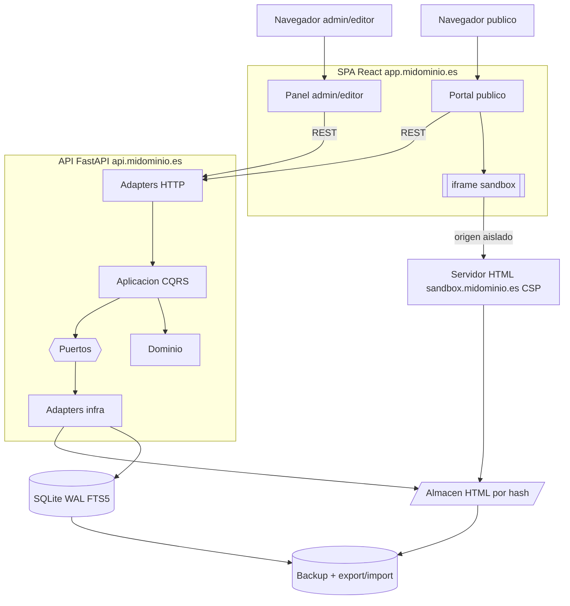
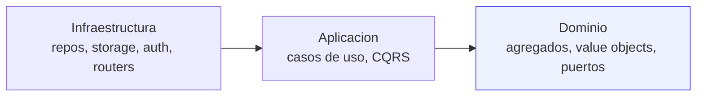
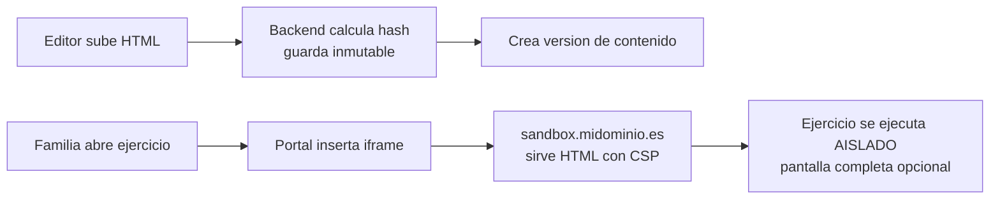

# Análisis y Diseño — Plataforma Educativa

**Proyecto:** CMS de ejercicios interactivos para infantil y primaria
**Tipo:** Aplicación web (escritorio y móvil), acceso público, open-source
**Stack:** FastAPI · React · SQLite (WAL) · Alembic · Docker (VPS)
**Documento:** Síntesis de las fases de descubrimiento, análisis, planificación y arquitectura.

---

## 1. Resumen ejecutivo

Plataforma web para alojar y ejecutar **ejercicios educativos interactivos** (ficheros HTML/CSS/JS
autocontenidos, ejecución en cliente) y **artículos de texto**, dirigidos a alumnado de infantil y
primaria. El acceso es público y sin cuentas de alumno; la gestión se realiza mediante dos perfiles
con permisos especiales: **administrador** (configuración del sitio y contenidos) y **editor**
(crear, modificar y borrar contenidos). El nombre y el logotipo del sitio son configurables.

La arquitectura recomendada es un **monolito modular hexagonal** con Clean Architecture y DDD
táctico ligero, aplicando CQRS y eventos de dominio **solo donde aportan valor**, evitando la
sobre-ingeniería impropia de un proyecto de cientos de usuarios mantenido por una persona.

El mayor reto de diseño es **ejecutar HTML/JS arbitrario de forma segura ante menores**; se resuelve
aislando los ejercicios en un iframe servido desde un **subdominio de origen distinto**. La
monetización se orienta a **adultos** (anuncios/afiliación en zonas no infantiles) y **donaciones**,
en cumplimiento del Reglamento de Servicios Digitales (DSA) y el RGPD.

---

## 2. Fase 1 — Descubrimiento

### 2.1 Requisitos consolidados

| Dimensión | Decisión |
|---|---|
| Naturaleza | Proyecto personal/open-source, España, monetización ligera para sostener el VPS |
| Núcleo | CMS de contenidos educativos (infantil + primaria) |
| Tipos de contenido | `interactivo` (HTML autocontenido) y `texto` (artículo WYSIWYG) |
| Metadatos | título, autor, fecha, descripción, ciclo, curso, asignatura, etiquetas, idioma, tipo |
| Taxonomía | Ciclos/cursos y asignaturas **configurables** desde administración |
| Acceso público | Sin cuentas de alumno; navegación por catálogo + buscador full-text |
| Roles | `admin` (config + contenidos) y `editor` (CRUD de contenidos), autenticación local |
| Seguridad del contenido | Ejercicios en **iframe con subdominio aislado** (origen separado, CSP, sandbox) |
| Gobierno del dato | Versionado ligero inmutable + papelera + auditoría + lineage |
| Analítica | Solo **contador de visitas agregado** por contenido (sin tracking) |
| Monetización | Anuncios/afiliación **solo en zonas de adultos** + donaciones; núcleo infantil limpio |
| Stack | FastAPI + React + SQLite (WAL) + Alembic, Docker sobre VPS |
| Operación | Best-effort (sin HA), backup diario automático, export/import |
| UI | Español; contenido puede ser inglés en asignaturas que proceda |

### 2.2 Restricción legal clave (menores + publicidad)

El marco aplicable en España (Reglamento de Servicios Digitales, **DSA art. 28**) **prohíbe la
publicidad personalizada basada en perfilado dirigida a menores** cuando la plataforma sabe con
razonable certeza que el usuario es menor. Una web dirigida explícitamente a infantil y primaria
entra de lleno en ese supuesto.

Conclusión de diseño:

- Publicidad **contextual / no personalizada**: permitida; viable solo en zonas para adultos.
- **Afiliación** (Amazon/AliExpress): restringida la incitación a la compra dirigida a niños.
- **Decisión:** monetización orientada a adultos (landing, recursos para docentes, blog) +
  **donaciones**. El núcleo infantil queda **sin publicidad y sin tracking** (Privacy by Design).
- Los espacios publicitarios se modelan como un **puerto configurable** marcado por zona
  (infantil/adulta), de modo que se pueda cambiar de proveedor o apagarlos sin tocar el núcleo.

---

## 3. Fase 2 — Análisis

### 3.1 Riesgos

**Críticos**

- **Ejecución de JS arbitrario ante menores.** Mitigación: iframe en subdominio aislado + CSP +
  atributo `sandbox`. Pieza no negociable del diseño.
- **Marco legal (menores + RGPD + DSA).** Mitigación: cero cuentas de alumno, cero cookies de
  seguimiento, contador de visitas anónimo y agregado, publicidad solo en páginas de adultos.

**Técnicos**

- **Amplificación de escritura del contador de visitas** sobre el único escritor de SQLite.
  Mitigación: agregar en memoria y **volcar por lotes**.
- **SQLite como fichero único = punto único de fallo.** Mitigación: WAL + backup diario + export/import.
- **HTML en disco local del VPS** acopla el contenido a la máquina. Mitigación: almacenamiento tras
  un **puerto** (local hoy, object storage mañana) + export/import.

**Operativos / negocio**

- **Bus factor = 1.** Simplicidad y documentación (`CLAUDE.md`) por encima de todo.
- **Expectativa de ingresos.** La monetización cubre el VPS en el mejor caso; gestionar expectativa.

### 3.2 Inconsistencias y puntos a vigilar

- **Sanitización asimétrica deliberada:** el artículo WYSIWYG es HTML que **se sanitiza**; el
  ejercicio interactivo es HTML que **no se sanitiza** (debe ejecutar JS) y por eso vive aislado por
  origen. La asimetría debe permanecer explícita en el código.
- **Versionado + papelera + export/import** comparten el almacenamiento de ficheros: los HTML se
  guardan **direccionados por hash** (inmutables), lo que da versionado, restauración y exportación
  coherente casi gratis.

### 3.3 Deuda técnica que se previene desde el inicio

Sanitización del HTML de artículos · separación de origen app↔sandbox desde el día 1 ·
configuración por entorno (Twelve-Factor) · migraciones Alembic versionadas desde el primer commit.

### 3.4 Arquitecturas evaluadas y comparación

| Criterio | A · Monolito modular hexagonal | B · Purista + broker | C · Serverless/micro |
|---|---|---|---|
| Ajuste a la escala (cientos) | Ideal | Sobredimensionado | Sobredimensionado |
| Coste VPS único | Mínimo | Requiere broker | Modelo distinto |
| Mantenibilidad (1 persona) | Alta | Carga cognitiva alta | Operación compleja |
| CQRS/EDA "cuando aporte valor" | Sí, selectivo | Los aplica siempre | Variable |
| Testabilidad | Alta | Alta | Media |
| Time-to-MVP | Rápido | Lento | Medio |

### 3.5 Recomendación final

**Opción A — Monolito modular hexagonal.** Se aplican: Clean Architecture, Hexagonal (Ports &
Adapters), DDD táctico ligero, Twelve-Factor, testabilidad, observabilidad, documentación como
código, Privacy/Security by Design. De forma **selectiva**: CQRS lógico (lectura/escritura sin
segunda BD) y eventos de dominio **en proceso** (auditoría y visitas). Se **descartan
deliberadamente**: microservicios, broker, event sourcing, BD de lectura separada y Kubernetes.

---

## 4. Fase 3 — Planificación

### 4.1 Roadmap

- **MVP:** cimientos · auth local · taxonomía configurable · CRUD de ejercicios interactivos ·
  sandbox en subdominio · portal público (navegación + buscador FTS) · configuración básica
  (nombre/logo) · backup + despliegue.
- **Fase 2:** editor WYSIWYG y tipo texto (con sanitización) · UI de versionado/restauración ·
  papelera con purga · auditoría y contador de visitas · monetización (zonas adultas) y donaciones ·
  export/import.
- **Fase 3:** comparación visual de versiones · multi-editor con revisión · object storage ·
  PWA/offline · i18n de interfaz.

### 4.2 Backlog (épicas)

| Épica | Descripción | Fase |
|---|---|---|
| E1 Cimientos | Monorepo, esqueleto hexagonal, Docker, Alembic, CI | MVP |
| E2 Identidad | Auth local, roles admin/editor | MVP |
| E3 Taxonomía | Catálogos configurables (ciclo, curso, asignatura, etiqueta) | MVP |
| E4 Contenidos | CRUD, versionado ligero, papelera | MVP |
| E5 Sandbox | Subida HTML por hash, serving aislado, iframe, pantalla completa | MVP |
| E6 WYSIWYG | Editor de artículos + sanitización | Fase 2 |
| E7 Portal público | Navegación por catálogo + buscador FTS + visor | MVP |
| E8 Configuración | Nombre, logo, slots publicitarios | MVP básico |
| E9 Auditoría/analítica | Audit log + contador de visitas por lotes | Fase 2 |
| E10 Monetización | Slots para adultos + donaciones | Fase 2 |
| E11 Operación | Backup, export/import, observabilidad, despliegue | MVP + Fase 2 |

### 4.3 Estimación (complejidad relativa, dependencias, orden)

| Épica | Complejidad | Depende de | Orden |
|---|---|---|---|
| E1 Cimientos | M | — | 1 |
| E2 Identidad | M | E1 | 2 |
| E3 Taxonomía | S | E1, E2 | 3 |
| E4 Contenidos | L | E2, E3 | 4 |
| E5 Sandbox | L | E4 | 5 |
| E7 Portal público | M | E4, E5 | 6 |
| E8 Configuración | S | E2 | 7 |
| E11 Operación (MVP) | M | E1 | transversal |

> No se estima en horas a propósito: depende de la velocidad real. La complejidad relativa y el
> orden de dependencias es lo accionable.

---

## 5. Fase 4 — Arquitectura

### 5.1 Diagrama lógico

El iframe **nunca** comparte origen con la app: carga desde `sandbox.midominio.es`, de modo que el
navegador impide por diseño que el JS del ejercicio acceda a sesión, cookies o DOM del CMS.

### 5.2 Capas y regla de dependencia

Las dependencias apuntan **siempre hacia el dominio**. El dominio no importa FastAPI ni SQLAlchemy.
Los puertos se declaran en el dominio; los adapters los implementan en infraestructura.

### 5.3 Contextos acotados

| Contexto | Responsabilidad |
|---|---|
| `content` | Ejercicios y artículos, tipos, versionado, papelera |
| `taxonomy` | Ciclos, cursos, asignaturas, etiquetas (configurables) |
| `identity` | Usuarios admin/editor, roles, autenticación |
| `media` | Almacenamiento y serving sandboxed de HTML |
| `auditing` | Registro de auditoría + lineage de versiones |
| `analytics` | Contador de visitas agregado |
| `configuration` | Nombre, logo, slots publicitarios, ajustes |

### 5.4 Flujo de un ejercicio (aislamiento)

### 5.5 Arquitectura de datos

- **SQLite (WAL)** con tablas: `content`, `content_version` (inmutable), catálogos de `taxonomy`,
  `user`/`role`, `audit_log`, `visit_counter`, `site_config`; búsqueda con **FTS5**.
- **HTML direccionado por hash**: `media/<hash[:2]>/<hash>.html`, inmutable (versionado/restauración).
- **Contador de visitas**: agregado en memoria, volcado por lotes (evita contención de escritura).
- **Lineage**: `content_version` (qué cambió) + `audit_log` (quién y cuándo).
- **Migraciones**: Alembic desde el primer commit.

### 5.6 Estrategia de testing

Unitarios (dominio/aplicación, puros) · Integración (repos contra SQLite temporal, endpoints) ·
Contrato (OpenAPI como contrato; cliente TS generado desde él) · E2E (Playwright: navegar, buscar,
pantalla completa, login + CRUD) · Test de seguridad del sandbox (el JS del ejercicio no alcanza el
origen padre).

### 5.7 CI/CD

GitHub Actions: lint+format → type-check → unit+integración → build Docker → E2E sobre stack
compuesto → en `main`, deploy al VPS por SSH (`docker compose pull && up`). Config por entorno
(Twelve-Factor), logs a stdout, procesos sin estado.

### 5.8 Observabilidad

Logging estructurado JSON a stdout · endpoint `/health` · métricas mínimas (Prometheus client) ·
alertas de caída (Uptime Kuma o similar). El `audit_log` es de negocio, separado de la
observabilidad técnica.

---

## 6. Fase 5 — Gobierno operativo (CLAUDE.md)

El repositorio incluye un `CLAUDE.md` en la raíz como **fuente de verdad operativa**, con:
contexto y objetivos · principios arquitectónicos · estándares de código · convenciones de
nomenclatura · estructura de carpetas · reglas de dominio, persistencia, API, seguridad, testing,
documentación, Git y Pull Request · reglas para generación automática de código por IA ·
**Definición de Terminado** · checklists para nuevas funcionalidades y para revisiones de código.

Reglas destacadas: el dominio permanece puro; las dependencias apuntan hacia adentro; los ejercicios
se sirven siempre desde el subdominio aislado; el HTML de artículos se sanitiza y el de ejercicios
no; toda escritura de alta frecuencia va por lotes; el lenguaje ubicuo del dominio se escribe en
español; las clases CSS del armazón van prefijadas (`cms-`).

---

## 7. Próximos pasos

1. Registrar el dominio y los subdominios `app.*`, `api.*`, `sandbox.*`.
2. Implementar la épica **E1 (cimientos)** sobre el esqueleto entregado.
3. Continuar por el orden de dependencias: E2 → E3 → E4 → E5 → E7.
4. Mantener `CLAUDE.md` y `ARCHITECTURE.md` sincronizados con el código a medida que se avanza.
